# 圖解操作步驟｜雷蒙的 AI 基礎環境安裝包（MAC）

跟著下面的截圖走，全程約 10～15 分鐘。不用寫程式，中途只會請你「輸入 Mac 密碼」和「開瀏覽器登入 GitHub」，都是正常關卡。

> 文字版說明與 Windows 做法見 [README](./README.md)。

---

## 一、下載到打開

**1. 解壓縮**：下載到的 `雷蒙的 AI 基礎環境安裝包(MAC).zip`，瀏覽器通常會自動解壓成 App（沒有的話雙擊它）。

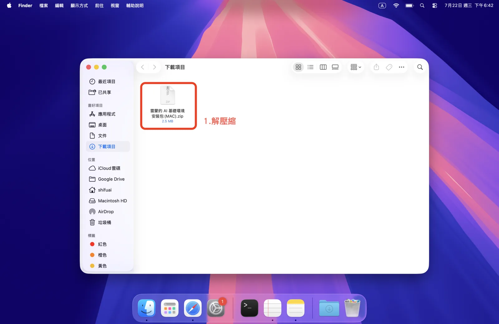

**2. 雙擊 App**：解壓後會出現星光背包圖示的 App，雙擊它。

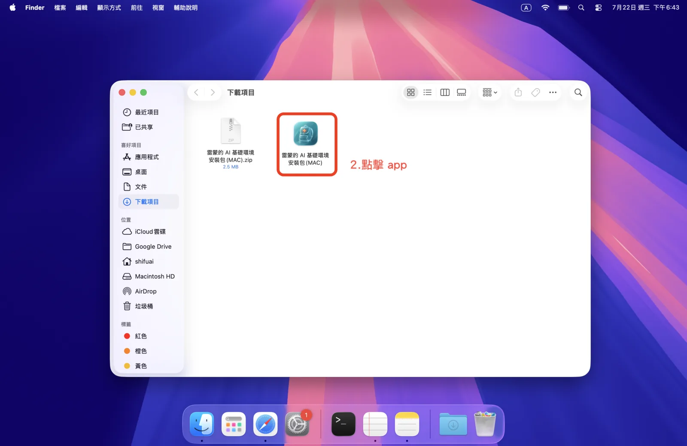

**3. 打開**：因為是已簽名＋公證的 App，系統會顯示「已檢查，未偵測到惡意軟體」，按「打開」即可。

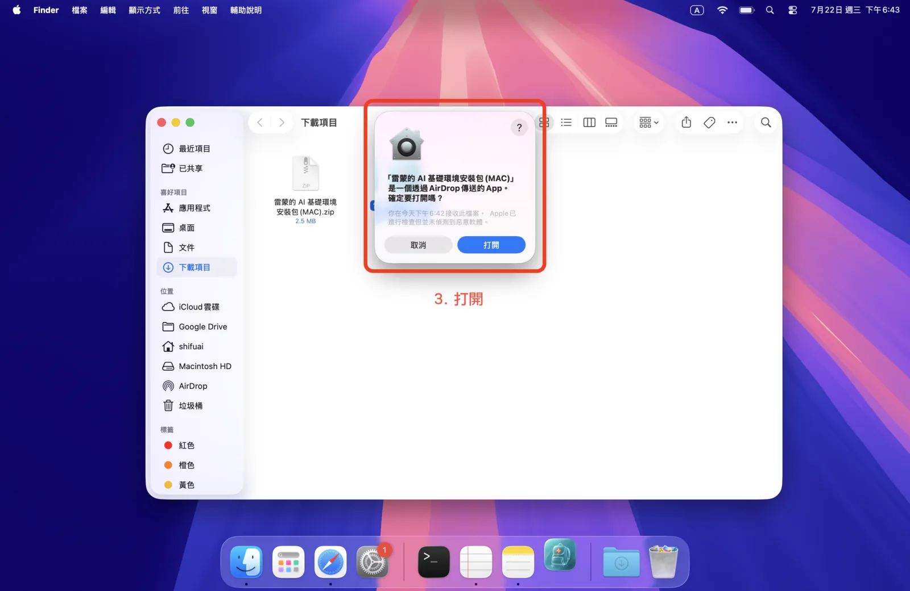

---

## 二、開場：挑你要裝的 AI 工具

基礎環境（git、Homebrew、GitHub）一定會裝。AI 工具用 **↑↓ 移動、空白鍵勾選（可複選）、Enter 確認**；四個選項各自獨立，想裝哪個就勾哪個，都不勾＝只裝基礎環境。

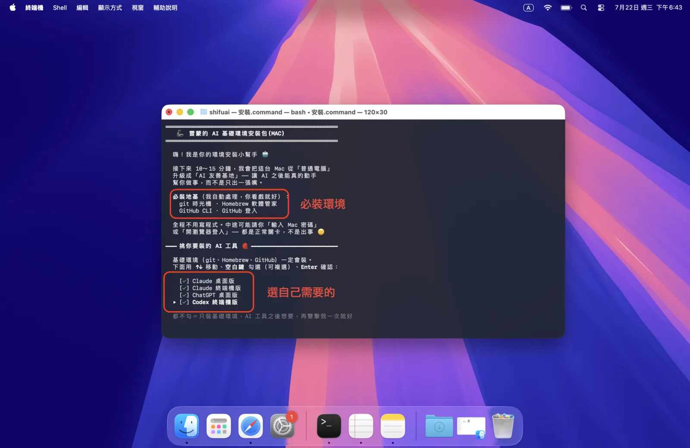

---

## 三、基礎環境

**5. 輸入 Mac 密碼**：安裝 Homebrew 時會請你輸入電腦密碼。打字時看不到字是正常的，打完按 Enter。

**6. 按 Enter 繼續**：Homebrew 會列出要安裝的位置，按 Enter 讓它繼續。這一站最久，約 3～5 分鐘，畫面卡著是在下載、不是當機。

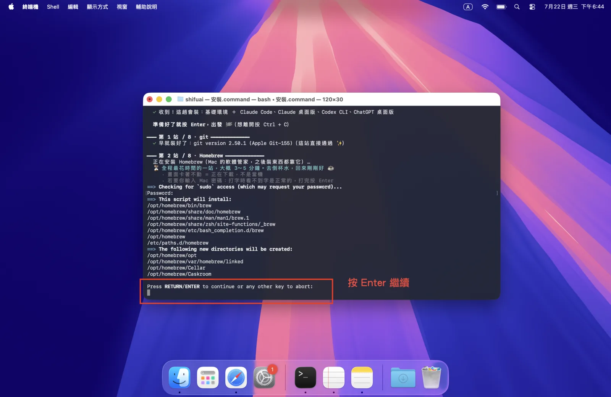

---

## 四、登入 GitHub

安裝程式會引導你登入 GitHub，照畫面選就好。

**7. 開始 GitHub 登入**：進到「GitHub 登入」這一站，會依序問你幾個問題，跟著往下選。

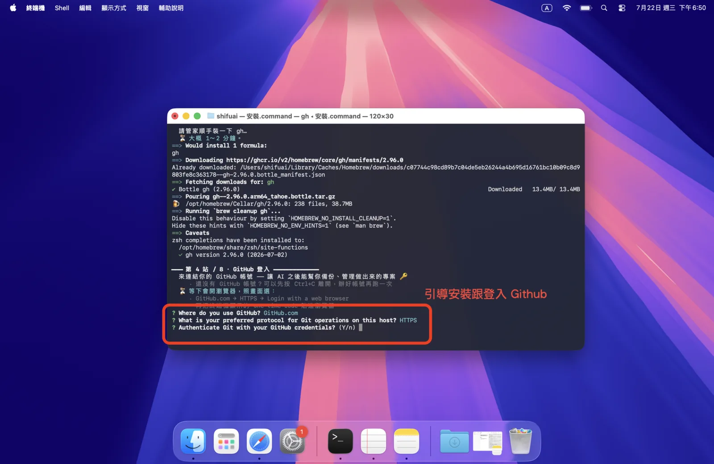

**8. 選 GitHub.com**：用方向鍵選 `GitHub.com`。

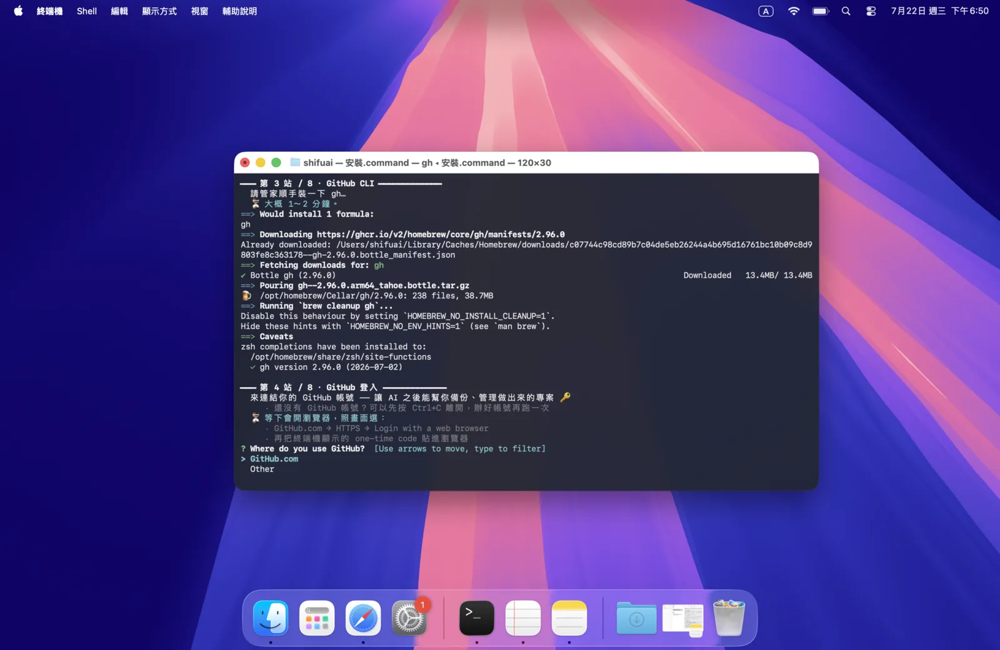

**9. 選 HTTPS**：協定選 `HTTPS`。

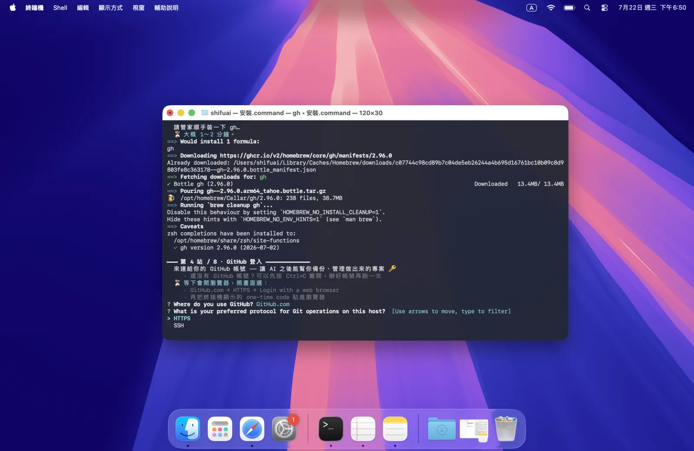

**10. 複製一次性驗證碼**：終端機會顯示一組 one-time code，先複製起來，按 Enter 會自動開瀏覽器。

**11. 瀏覽器：Device Activation**：瀏覽器打開後按「Continue」。

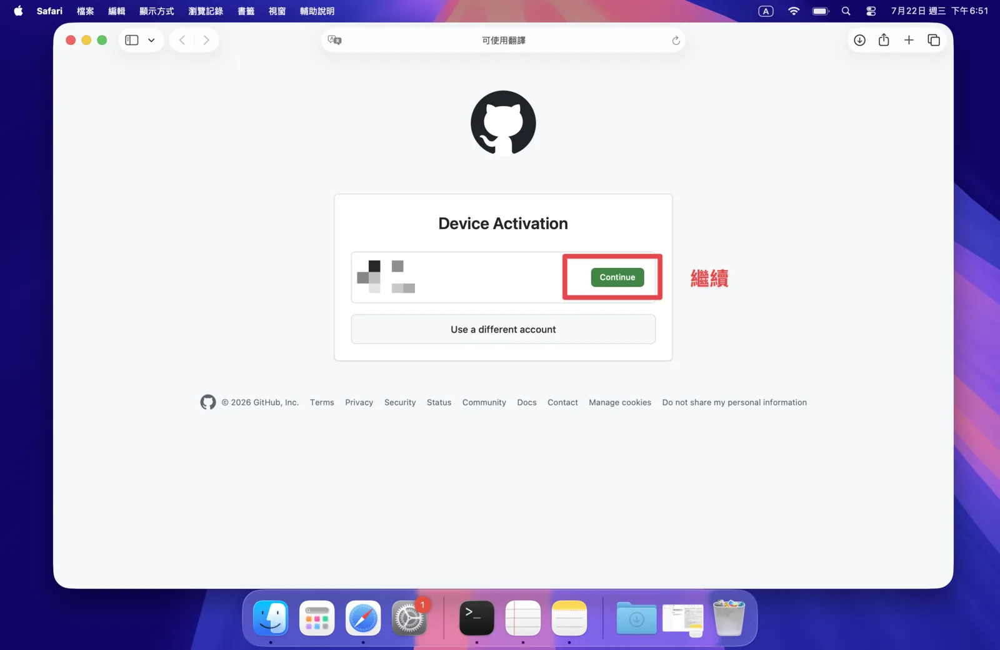

**12. 貼上驗證碼**：把剛剛複製的驗證碼貼進去，按 Continue。

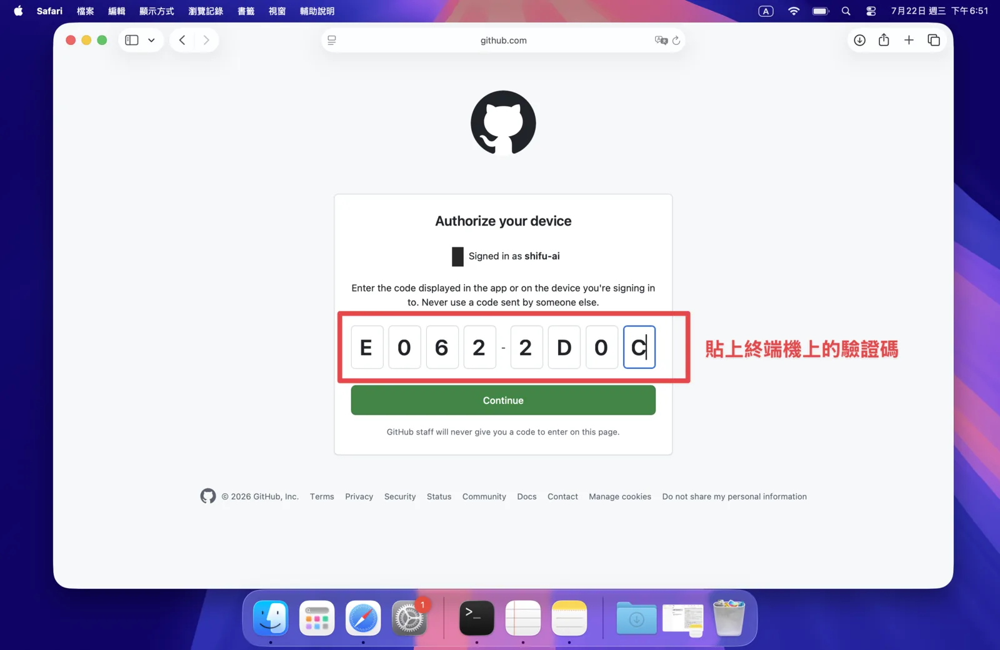

**13. 授權**：確認權限後按綠色的「Authorize github」。

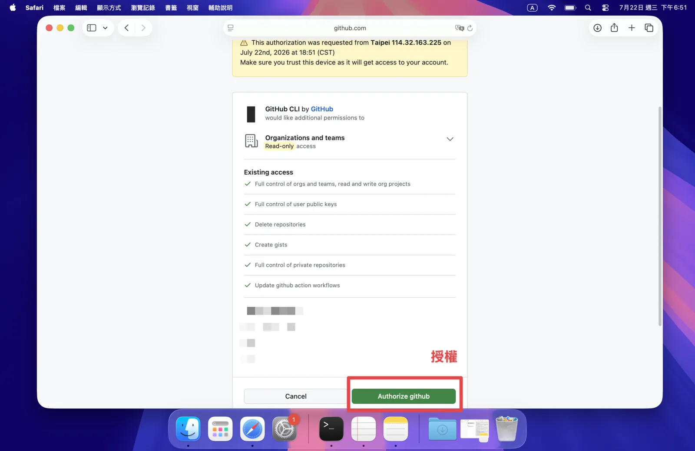

**14. 連結完成**：看到「Congratulations, you're all set!」就代表 GitHub 登入好了，可以關掉瀏覽器回到終端機。

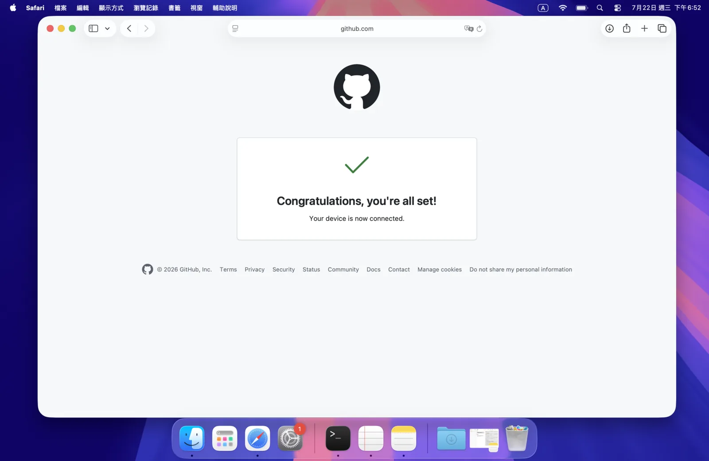

---

## 五、其他工具與完成

**15. 繼續安裝你勾選的工具**：接著會自動裝你勾的 AI 工具（例如 Codex CLI、ChatGPT 桌面版），跟著跑就好。

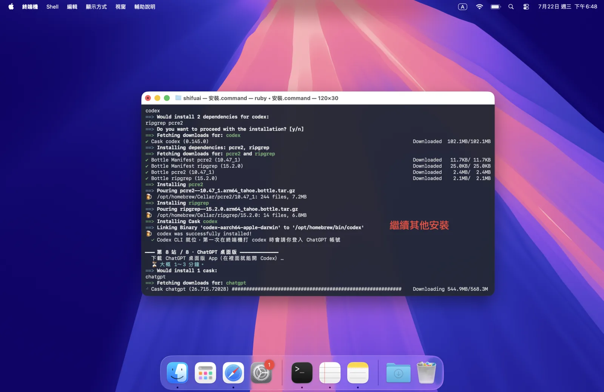

**16. 完成**：最後畫面會依**實際結果**逐項打勾。看到這張就全部裝好了，按 Enter 關閉視窗即可。

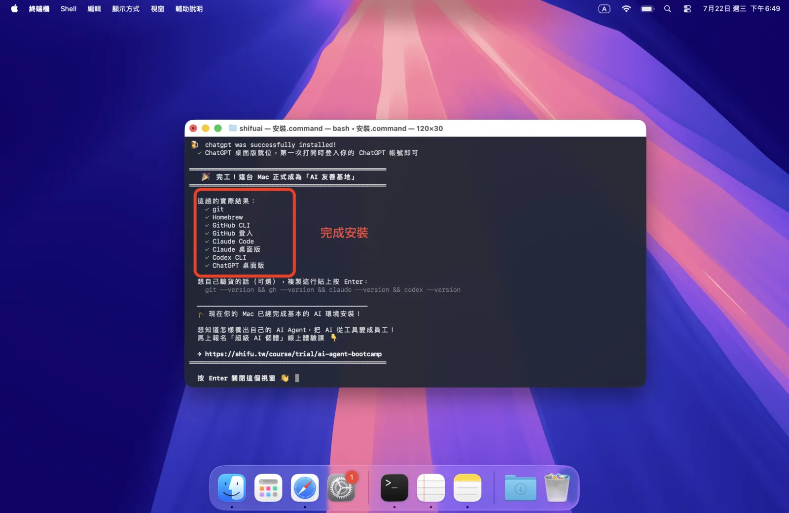

---

裝完之後，依你勾選的工具，在終端機打 `claude` 或 `codex`，或打開對應的桌面版 App 登入帳號，就能開始用。
