# 圖解操作步驟｜雷蒙的 AI 基礎環境安裝包（MAC）

跟著下面的截圖走，全程約 10～15 分鐘。不用寫程式，中途只會請你「輸入 Mac 密碼」和「開瀏覽器登入 GitHub」，都是正常關卡。

> 文字版說明與 Windows 做法見 [README](./README.md)。Intel 與 M 系列使用同一個安裝包，仍是雙擊後在終端機自動安裝，不用自行輸入指令。

---

## 一、下載到打開

**1. 解壓縮**：下載到的 [`雷蒙的 AI 基礎環境安裝包(MAC).zip`](https://raw.githubusercontent.com/Raymondhou0917/claude-code-resources/master/env-installer/%E9%9B%B7%E8%92%99%E7%9A%84%20AI%20%E5%9F%BA%E7%A4%8E%E7%92%B0%E5%A2%83%E5%AE%89%E8%A3%9D%E5%8C%85(MAC).zip)，瀏覽器通常會自動解壓成 App（沒有的話雙擊它）。

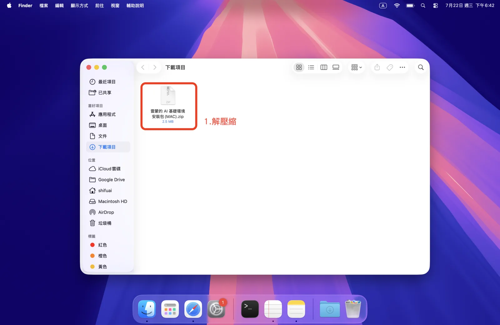

**2. 雙擊 App**：解壓後會出現星光背包圖示的 App，雙擊它。

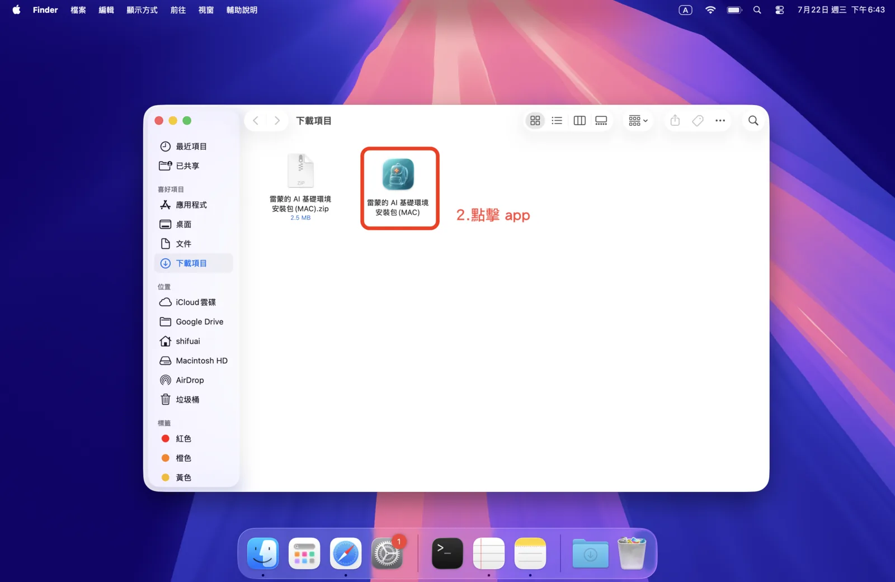

**3. 打開**：因為是已簽名＋公證的 App，系統會顯示「已檢查，未偵測到惡意軟體」，按「打開」即可。

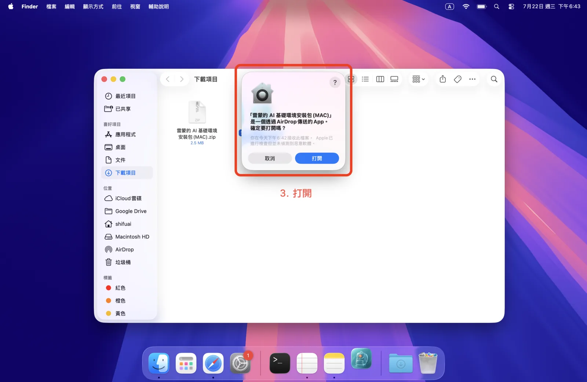

---

## 二、開場：挑你要裝的 AI 工具

基礎環境（git、GitHub）會自動安裝；Homebrew 依電腦條件安排，Intel 會使用官方下載路線。AI 工具用 **↑↓ 移動、空白鍵勾選（可複選）、Enter 確認**；四個選項各自獨立，想裝哪個就勾哪個，都不勾＝只裝基礎環境。

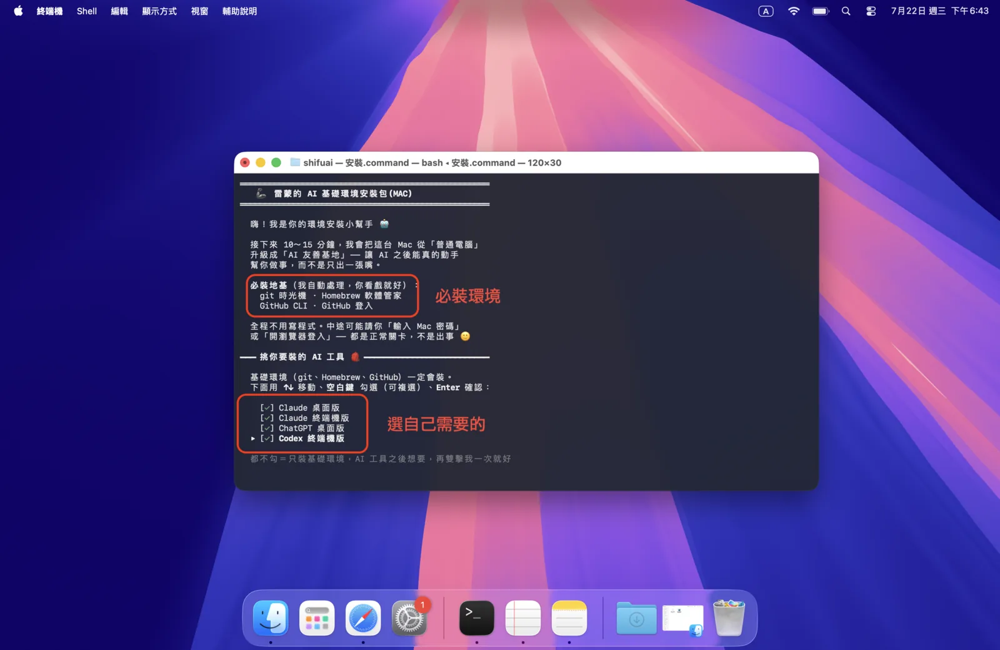

---

## 三、基礎環境

**5. 輸入 Mac 密碼**：安裝 Homebrew 或官方安裝包時，可能請你輸入電腦密碼。打字時看不到字是正常的，打完按 Enter。

**6. 按畫面繼續**：若使用 Homebrew，它會列出安裝位置，按 Enter 讓它繼續，通常約 3～5 分鐘。Intel 或 macOS 13–14 會跳過這個畫面，直接使用官方下載安裝你勾選的工具，這是正常情況。下載時間依網路而異；若顯示失敗，請看結尾結果再重試。

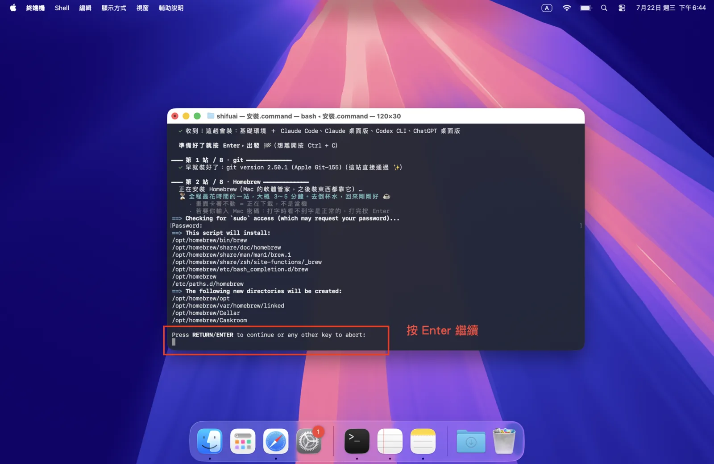

---

## 四、登入 GitHub

安裝程式會引導你登入 GitHub，照畫面選就好。

**7. 開始 GitHub 登入**：進到「GitHub 登入」這一站，會依序問你幾個問題，跟著往下選。

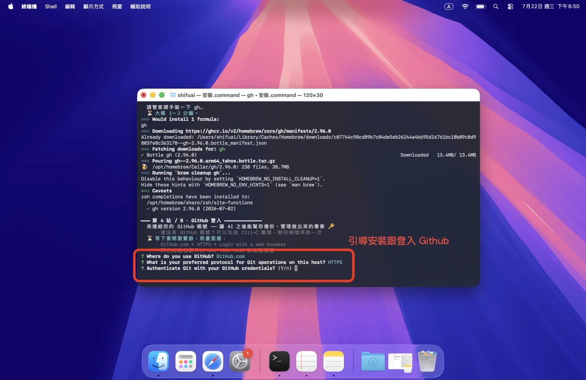

**8. 選 GitHub.com**：用方向鍵選 `GitHub.com`。

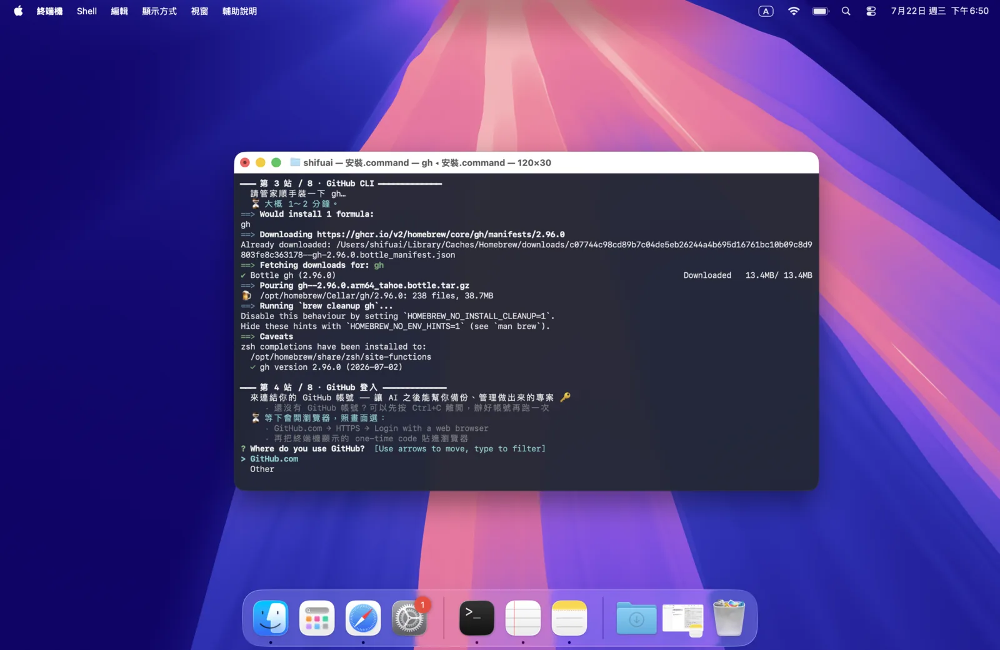

**9. 選 HTTPS**：協定選 `HTTPS`。

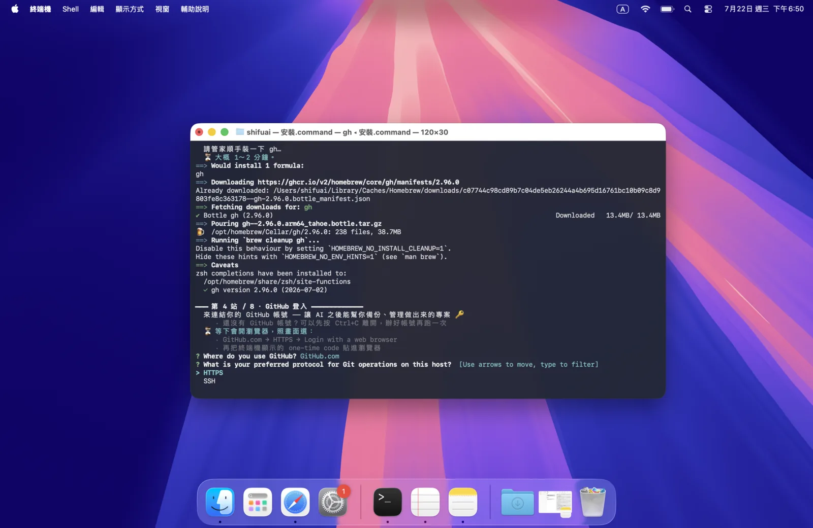

**10. 複製一次性驗證碼**：終端機會顯示一組 one-time code，先複製起來，按 Enter 會自動開瀏覽器。

**11. 瀏覽器：Device Activation**：瀏覽器打開後按「Continue」。

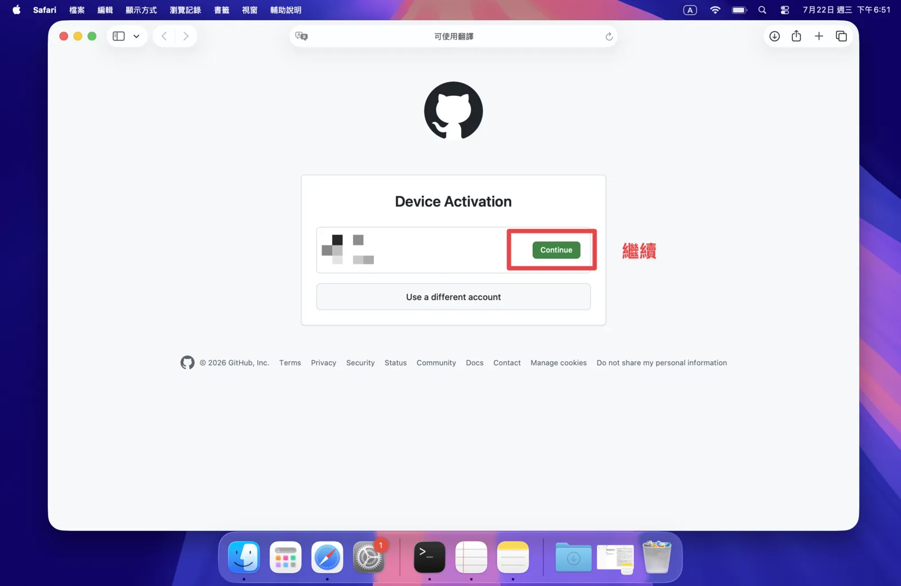

**12. 貼上驗證碼**：把剛剛複製的驗證碼貼進去，按 Continue。

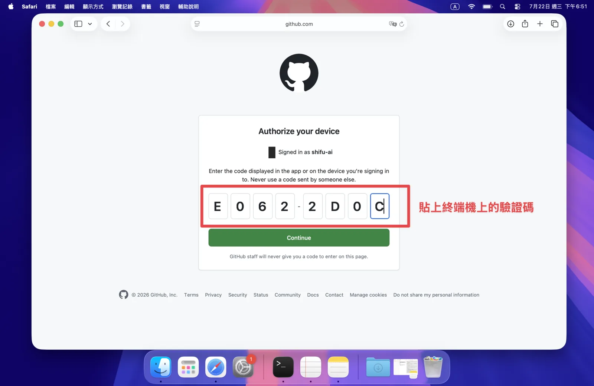

**13. 授權**：確認權限後按綠色的「Authorize github」。

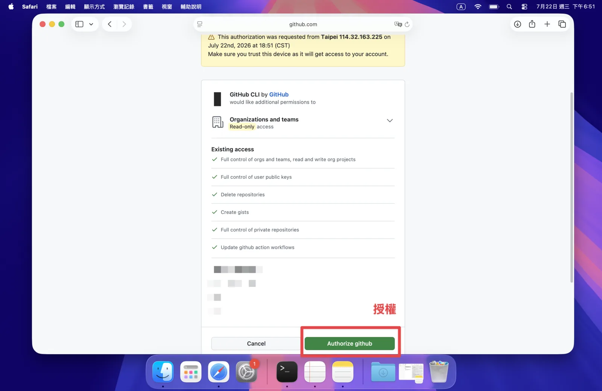

**14. 連結完成**：看到「Congratulations, you're all set!」就代表 GitHub 登入好了，可以關掉瀏覽器回到終端機。

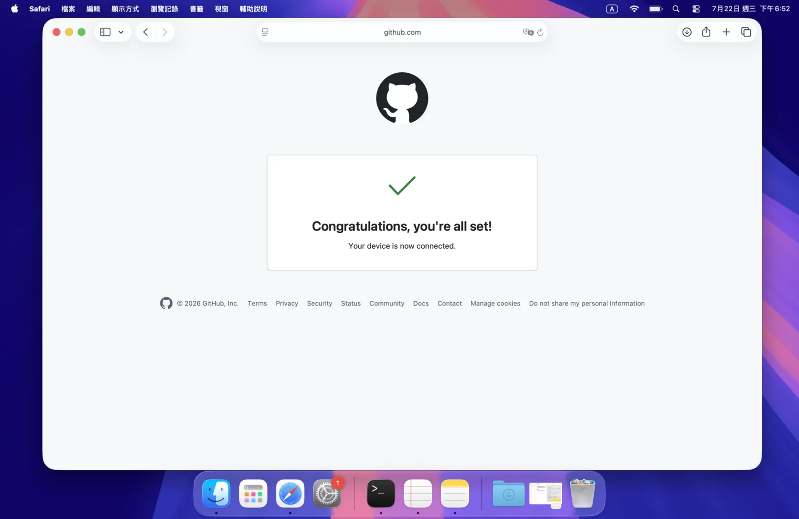

---

## 五、其他工具與完成

**15. 繼續安裝你勾選的工具**：接著會自動裝你勾的 AI 工具（例如 Codex CLI、ChatGPT 桌面版），跟著跑就好。

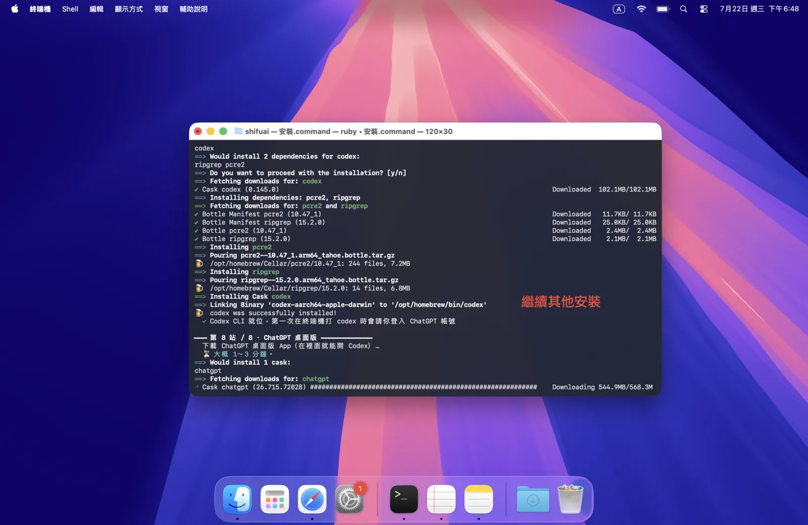

**16. 完成**：最後畫面會依**實際結果**逐項打勾。請確認需要的項目都打勾，再按 Enter 關閉視窗。有失敗項目可以重新雙擊安裝包，已可正常使用的工具會跳過。終端機的「程序完成」只表示程式結束，不等於安裝成功。

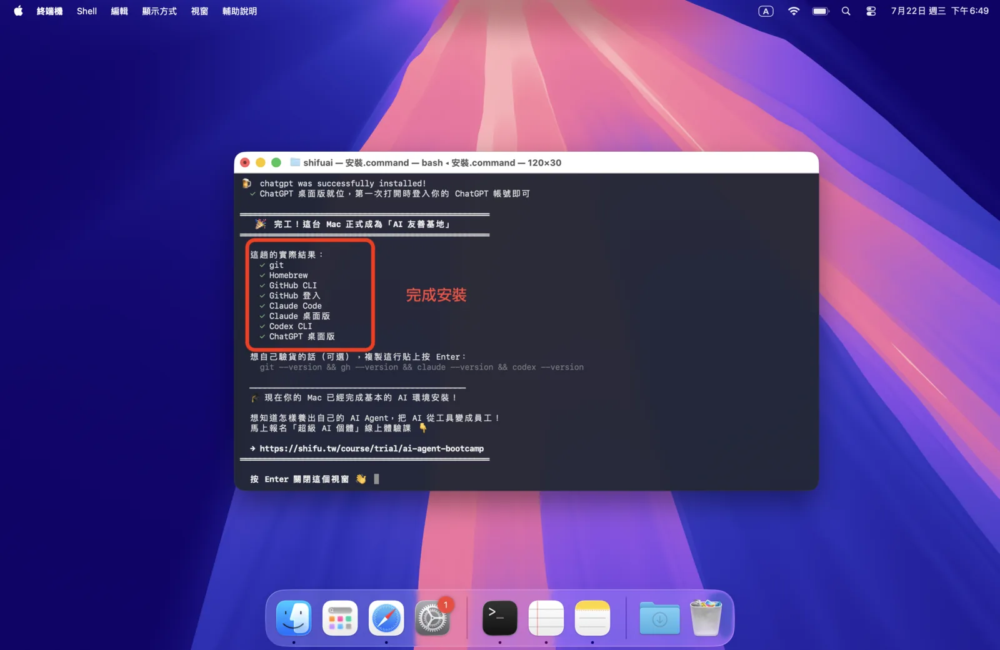

---

裝完之後，依你勾選的工具，在終端機打 `claude` 或 `codex`，或打開對應的桌面版 App 登入帳號，就能開始用。

## 舊 Mac 與重跑說明

- Intel Mac 不需要自行安裝 Homebrew，也不需要另外選 Intel 安裝包。
- ChatGPT 桌面版需要 macOS 14 以上；macOS 13 勾選它時會顯示未安裝成功，其他支援的工具仍會繼續。
- 若既有 App 不相容或簽名驗證失敗，安裝包會保留它、不直接覆蓋；請依該工具官方下載頁更新。
- 中斷後可關掉原安裝視窗再重新雙擊，不要同時開兩個安裝程序。需要求助時，提供 macOS 版本、處理器與失敗項目畫面，勿提供密碼、登入驗證碼或權杖。
